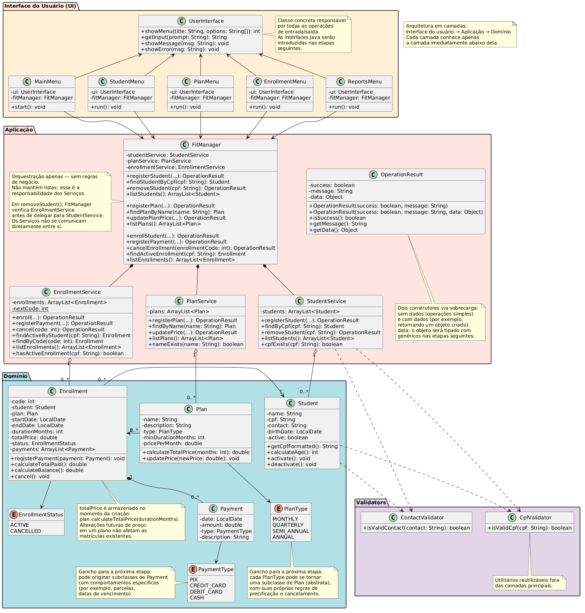
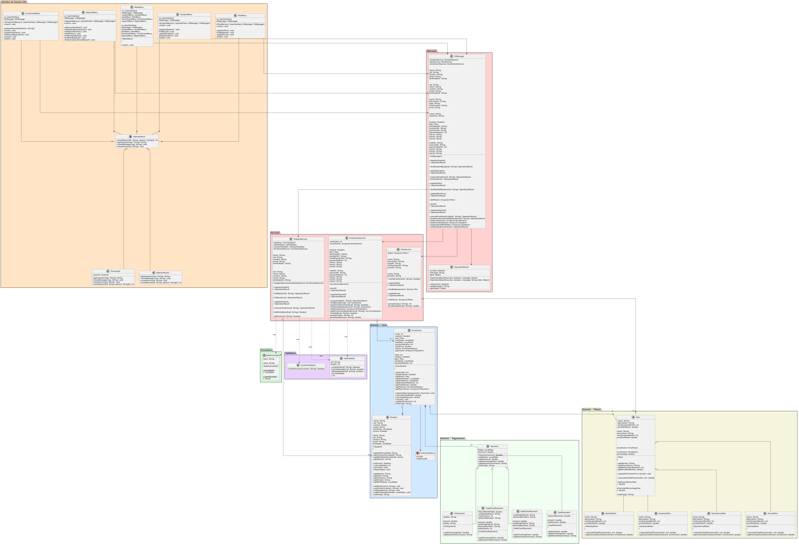

# Relatório — FitManager

## 1. Introdução

O FitManager é um sistema de gestão de academia desenvolvido em Java como trabalho prático da disciplina de Programação Orientada a Objetos. O sistema permite o gerenciamento de alunos, planos, matrículas e pagamentos, seguindo uma arquitetura em três camadas: Interface do Usuário (UI), Aplicação e Domínio.

Nesta primeira etapa, foi construída a base funcional do sistema — modelando as entidades do domínio, implementando as operações essenciais de cadastro, consulta e listagem, e organizando o código de forma que o projeto possa evoluir com consistência nas etapas seguintes.

---

## 2. Integrantes e contribuições

- **Gabriel Gonçalves de Assis de Souza** — Responsável pela gestão de matrículas e pagamentos: `Enrollment.java`, `EnrollmentService.java`, `EnrollmentStatus.java`, `Payment.java`, `PaymentType.java`, `FitManager.java`.

- **Marcelly Lais Ferreira de Almeida** — Responsável pela gestão de planos e pelo padrão de resultado das operações: `Plan.java`, `PlanType.java`, `PlanService.java`, `OperationResult.java`. Responsável também pela documentação: `README.md`, `report.md`.

- **Maria Rita do Nascimento Vieira** — Responsável pela gestão de alunos e pela interface com o usuário: `Student.java`, `StudentService.java`, `CpfValidator.java`, `ContactValidator.java`, `UserInterface.java`, `Main.java`, `MainMenu.java`, `StudentMenu.java`, `PlanMenu.java`, `EnrollmentMenu.java`, `ReportsMenu.java`.

---

## 3. Diagrama de classes final



---

## 4. Decisões de projeto

### 4.1 Armazenamento do CPF
O CPF é armazenado sem formatação, contendo apenas os 11 dígitos numéricos. Consideramos armazená-lo com formatação (`123.456.789-00`), o que melhoraria a exibição direta, mas optamos pela forma sem formatação pois simplifica buscas e comparações em todo o sistema, eliminando a necessidade de normalização antes de cada operação. A formatação é aplicada apenas na exibição, via `getCpfFormatted()` na classe `Student`.

### 4.2 Validação do CPF
Implementamos o algoritmo completo de verificação dos dígitos verificadores na classe `CpfValidator`. A alternativa seria validar apenas o formato básico — 11 dígitos numéricos — o que seria mais simples mas rejeitaria apenas CPFs obviamente inválidos. Optamos pela validação completa pois aumenta a robustez do sistema, rejeitando CPFs numericamente inválidos que passariam por uma validação superficial.

### 4.3 Remoção vs. inativação de alunos
O grupo adotou a estratégia de inativação via `deactivate()`, sem remover o objeto `Student` da lista. A remoção física seria mais simples, mas deixaria referências inválidas nos objetos `Enrollment` já existentes. A inativação preserva o histórico de matrículas associadas e mantém a integridade dos dados. O método `deleteStudent()` no `FitManager` chama `deactivateStudent()` no `StudentService`, que apenas marca o aluno como inativo sem removê-lo da coleção.

### 4.4 Validação da data de nascimento
A conversão e validação da data de nascimento é feita pelo método privado `parseDate(String)`, que fica na classe **FitManager** e é chamado nos métodos `registerStudent` e `updateStudent`.
O método recebe a data como String e faz as checagens: verifica se a `string` não é nula ou vazia, depois confere se ela está no padrão `yyyy-MM-dd` usando uma expressão regular e extrai os valores de ano, mês e dia para garantir que o mês está entre 1 e 12 e o dia entre 1 e 31. Se qualquer uma dessas checagens falhar, o método retorna `null.`
Quando o retorno é `null`, o fluxo é cortado na hora e o sistema devolve uma mensagem de erro: **"Data de nascimento inválida. Use o formato yyyy-MM-dd."** , somente quando a data passa por tudo isso é que o `LocalDate` é criado e o cadastro ou atualização segue em frente.
### 4.5 Seleção do tipo de plano
Os valores de `PlanType` são apresentados ao usuário numerados no menu, e o número digitado é convertido para o enum via `PlanType.fromOptionValue()`. Consideramos aceitar a entrada como texto e converter para o enum, o que seria mais flexível, mas a abordagem numérica é mais robusta e evita erros de digitação. O mesmo padrão é adotado para `PaymentType`.

### 4.6 `fromOptionValue` retorna null
O método `PlanType.fromOptionValue()` retorna `null` em vez de lançar exceção quando o valor não corresponde a nenhuma opção válida. A alternativa seria lançar `IllegalArgumentException`, capturada no menu com `try/catch`. Optamos por retornar `null` pois é mais consistente com o padrão adotado nos métodos de busca do sistema — `findByName()` também retorna `null` quando não encontra o objeto. A validação fica centralizada no `PlanService` via `OperationResult(false, "Tipo de plano inválido.")`.

### 4.7 Lógica de desconto por tipo de plano
O método `calculateTotalPrice(int months)` aplica descontos com base no tipo do plano: QUARTERLY 10%, SEMI_ANNUAL 20%, ANNUAL 30% e MONTHLY sem desconto. A lógica usa uma estrutura condicional `if/else` por tipo, o que é adequado para esta etapa. Essa estrutura é intencionalmente temporária — na próxima etapa, cada `PlanType` se tornará uma subclasse de `Plan` com sua própria regra de cálculo, eliminando o `if/else` por polimorfismo.

### 4.8 Encapsulamento das coleções internas
Os métodos de listagem como `listPlans()` retornam `new ArrayList<>(plans)` em vez da lista interna diretamente. A alternativa seria expor a lista diretamente, o que permitiria que classes externas a modificassem sem passar pelas validações do serviço. A cópia defensiva garante o encapsulamento da coleção e foi adotada de forma consistente em todos os serviços.

### 4.9 Métodos de busca retornam null
Métodos como `findByName()` e `findByCpf()` retornam `null` quando o objeto não é encontrado, em vez de retornar um `OperationResult` com os dados embutidos. Essa convenção foi adotada de forma consistente em todo o sistema — o chamador sempre verifica o retorno antes de usar o objeto. Os métodos públicos dos serviços que são chamados pelos menus retornam `OperationResult`; os métodos internos de busca retornam `null`.

### 4.10 Instanciação dos menus
Os menus são instanciados no início do programa, em `Main.java`, e passados como parâmetros. A alternativa seria criar cada menu sob demanda no momento em que fosse necessário. Optamos pela instanciação antecipada pois garante que todas as dependências estejam disponíveis desde o início e facilita o rastreamento do fluxo de execução. `Main.java` é responsável por criar e conectar todos os objetos necessários.

### 4.11 Campo `data` em `OperationResult`
O campo `data` é do tipo `Object` nesta etapa, permitindo retornar qualquer objeto junto com o resultado da operação. Por exemplo, `registerPlan()` retorna o `Plan` criado para que o menu o exiba sem precisar buscá-lo novamente. Consideramos não incluir o campo nesta etapa, mas optamos por mantê-lo pois o documento prevê sua evolução para um tipo genérico `T` nas etapas seguintes, e já utilizá-lo agora prepara o sistema para essa transição.

### 4.12 Pacote `validators`
As classes CpfValidator e ContactValidator foram organizadas em um pacote separado validators, fora das três camadas principais. Optamos pelo pacote separado pois são utilitários reutilizáveis que não pertencem exclusivamente a nenhuma das camadas. Para manter a entidade de domínio (Student) pura e focada apenas em seus próprios dados, a responsabilidade de acionar o pacote validators foi delegada exclusivamente para a camada de aplicação, dentro do StudentService.

### 4.13 Pagamento inicial mínimo
O pagamento mínimo para efetivar a matrícula foi definido como o valor exato da primeira parcela mensal. O cálculo ocorre na camada de aplicação, dentro do método enroll() do EnrollmentService. A lógica divide o valor total do contrato (com os devidos descontos do plano) pelo número de meses (plan.calculateTotalPrice(durationMonths) / durationMonths). Se o valor fornecido for menor que essa parcela, o serviço barra a criação do objeto e retorna um OperationResult de falha.

### 4.14 Data de término da matrícula
O cálculo da endDate ocorre de forma isolada dentro do construtor da classe de domínio Enrollment. O EnrollmentService não calcula datas, apenas repassa a startDate. O Domínio utiliza LocalDate, aplicando o método startDate.plusMonths(durationMonths) para definir com precisão absoluta o dia do vencimento final do contrato no momento exato em que ele é instanciado.

### 4.15 Atomicidade do fluxo de matrícula
A atomicidade é garantida pela ordem de execução dentro de EnrollmentService.enroll(). Embora as validações e a instanciação de Enrollment e Payment ocorram em etapas separadas, a persistência na memória (o this.enrollments.add()) é estritamente a última instrução executada. Se ocorrer qualquer falha nas validações anteriores ou na criação do pagamento, a execução é interrompida pelo retorno de um OperationResult de erro, impedindo que matrículas incompletas ou sem pagamento sejam salvas no sistema.

### 4.16 Quem verifica matrícula ativa
A responsabilidade por verificar a existência de matrícula ativa reside exclusivamente na camada de aplicação, dentro do EnrollmentService (através do método auxiliar hasActiveEnrollment()). O FitManager atua apenas como um orquestrador e não detém conhecimento sobre regras de unicidade. Ele repassa o CPF para o serviço, e o serviço decide se a operação prossegue ou não.

### 4.17 Quem cria o objeto `Payment`
A instanciação do objeto Payment ocorre dentro do EnrollmentService. O serviço atua como o controlador financeiro: ele recebe o valor e o PaymentType vindos do FitManager, instancia o Payment e então o injeta no domínio chamando o método registerPayment() da classe Enrollment.

### 4.18 Situação financeira após quitação
O sistema adota o bloqueio estrito de pagamentos excedentes. Dentro do EnrollmentService.registerPayment(), o sistema compara o valor da transação com o saldo devedor atual (flagEnrollment.calculateBalance()). Se a tentativa de pagamento for maior que a dívida, a operação é bloqueada com uma mensagem de erro, impedindo a geração de saldos negativos (créditos) para a academia.

### 4.19 Taxas de cancelamento
O grupo optou por manter a regra de negócio focada e não aplicar taxas punitivas para cancelamentos antecipados. A lógica de cancelamento (no EnrollmentService) altera o status do contrato para CANCELLED e gera um extrato informando o saldo devedor exato até o momento, sem acréscimo de multas, cessando a cobrança dos meses futuros.

### 4.20 Data e motivo do cancelamento
Decidimos não implementar os atributos adicionais cancellationDate e cancellationReason na entidade Enrollment. A indicação de cancelamento é controlada puramente pelo enum EnrollmentStatus.CANCELLED, o que atende plenamente ao requisito de bloquear o acesso do aluno na catraca, mantendo a estrutura da classe de domínio limpa e coesa.

### 4.21 Pendências financeiras como critério de bloqueio
A arquitetura definida exige que o StudentService consulte as regras financeiras antes de efetivar uma remoção. Alunos que possuam matrículas com status ativo, ou matrículas canceladas onde o calculateBalance() > 0, terão sua remoção bloqueada, garantindo a preservação do histórico de dívidas da academia.

### 4.22 Ordenação nas listagens
A ordenação é tratada na camada de Aplicação (Services). Para evitar duplicação, a lógica de ordenação é executada imediatamente após operações de inserção ou atualização de dados, garantindo que as coleções em memória permaneçam consistentes. Além disso, utilizamos a API de Comparators do Java para manter o código conciso e reutilizável.
### 4.23 Tratamento de entrada numérica inválida
O tratamento de entradas com tipo incorreto é realizado de forma preventiva diretamente na camada de Aplicação (nos Services). A estratégia adotada consiste em receber os dados numéricos repassados pela interface como String e validá-los utilizando Expressões Regulares (ex: input.matches("\\d+")) antes de realizar a conversão real. Caso o formato seja inválido (como letras digitadas em campos de preço ou duração), o serviço bloqueia a operação imediatamente e retorna um OperationResult com uma mensagem de erro amigável. Essa abordagem garante que a aplicação nunca tente fazer o parse de dados corrompidos, evitando o encerramento do programa por exceções (como NumberFormatException) e mantendo o sistema estável

### 4.24 Situação financeira como estado ou cálculo
Toda verificação financeira é feita por um cálculo dinâmico em tempo real através do método calculateBalance() da entidade Enrollment, que subtrai a soma do histórico de pagamentos (calculateTotalPaid()) do valor total do contrato (totalPrice).

### 4.25 Pontos de extensão para próximas etapas
O grupo identificou dois pontos principais de extensão já preparados nesta etapa. O primeiro é a evolução de `PlanType` para subclasses de `Plan` — o `if/else` em `calculateTotalPrice()` é temporário e será substituído, onde cada subclasse implementará sua própria regra de cálculo. O segundo é a conversão de `UserInterface` de classe concreta para interface Java, permitindo múltiplas implementações como terminal e interface gráfica. Os menus já referenciam `UserInterface` pelo tipo, o que facilita essa transição sem reescrita dos menus.

---

## 5. Regras de negócio implementadas

#### Regras de Alunos e Planos:

- Unicidade do CPF: O CPF deve ser único no sistema — verificado em StudentService.registerStudent().
- Validação do CPF: O CPF deve ser válido com verificação dos dígitos verificadores — implementado em CpfValidator.isValidCpf().
- Campos Obrigatórios: Todos os campos do aluno são obrigatórios — verificado em StudentService.registerStudent().
- Unicidade do Plano: O nome do plano deve ser único — verificado em PlanService.registerPlan() via nameExists().
- Valores Positivos: A duração mínima do plano deve ser maior que zero e o preço por mês deve ser positivo — ambos verificados em PlanService.registerPlan().
- Imutabilidade do Histórico: A alteração de preço não afeta matrículas existentes — garantida porque totalPrice é calculado e armazenado no momento da criação da matrícula via plan.calculateTotalPrice(durationMonths).
- Validação de Tipo: O tipo de plano deve ser válido — verificado em PlanService.registerPlan() via verificação de null.

#### Regras de Matrícula e Financeiras:
- Bloqueio de Inativação: Um aluno com matrícula ativa ou dívida pendente não pode ser removido/inativado — verificado em StudentService.removeStudent() mediante consulta ao EnrollmentService.
- Limite de Matrículas: Um aluno não pode ter mais de uma matrícula ativa simultaneamente — verificado em EnrollmentService.enroll().
- Duração Mínima: A duração da matrícula escolhida pelo aluno deve ser maior ou igual à duração mínima exigida pelo plano — verificado em EnrollmentService.enroll().
- Trava de Pagamento: Um pagamento não pode ser registrado em uma matrícula que já encontra-se cancelada — verificado em EnrollmentService.registerPayment().
- Status Definitivo: Uma matrícula cancelada não pode voltar a ser ativa (não possui fluxo de reativação) — garantido pela arquitetura de encapsulamento e ausência de métodos de reversão de status na classe de domínio Enrollment.

---

## 6. Dificuldades e aprendizados

O desenvolvimento desta etapa trouxe desafios em frentes distintas — técnicas e organizacionais — que o grupo enfrentou ao longo do processo.

**Controle de versão com Git e GitHub**

A maior dificuldade organizacional foi o uso correto do Git. No início do projeto, o grupo não tinha familiaridade suficiente com o fluxo de branches definido — criar branches a partir de `stage-1`, abrir pull requests e evitar commits diretos na `main`. Houve situações em que alterações foram feitas diretamente em branches erradas e conflitos de merge precisaram ser resolvidos manualmente. O processo de entender como integrar o trabalho de três pessoas em um único repositório sem sobrescrever o que o colega havia feito foi, na prática, mais desafiador do que o esperado. Com o tempo, o grupo foi se adaptando ao fluxo e os commits passaram a ser mais frequentes e direcionados — mas a curva de aprendizado com o Git foi real e tomou tempo que poderia ter sido dedicado à implementação.

**Arquitetura em camadas**

Outro ponto de dificuldade foi compreender, na prática, onde cada responsabilidade deveria residir. No início, o grupo começou implementando as classes de domínio sem ter clareza sobre como a comunicação entre as camadas funcionaria. Isso gerou retrabalho: algumas lógicas foram colocadas em lugares errados e precisaram ser movidas depois que a estrutura foi melhor compreendida. Entender que o menu coleta e exibe, que o `FitManager` coordena, e que os serviços validam e executam parece simples na teoria — mas exigiu revisão constante durante a implementação para não misturar responsabilidades. A separação de camadas foi o conceito que mais demandou atenção coletiva ao longo do desenvolvimento.

**Tratamento de entradas e coordenação da interface**

A parte técnica que mais gerou dificuldade foi o tratamento de entradas inválidas nos menus e a padronização das mensagens exibidas ao usuário. Dois problemas específicos se combinaram: tratar `NumberFormatException` quando o usuário digita letras em campos numéricos e garantir que todos os menus apresentassem feedback de forma consistente — sem que cada menu tivesse sua própria lógica de exibição. Centralizar as saídas em `UserInterface` e garantir que nenhum menu chamasse `System.out` diretamente foi mais trabalhoso do que o grupo antecipou, especialmente porque envolvia coordenação entre os três membros que desenvolveram menus distintos.

**Divisão do trabalho**

A coordenação entre os membros foi um ponto positivo desta etapa. A divisão por área de responsabilidade — alunos, planos, matrículas e pagamentos — funcionou bem e permitiu que o grupo trabalhasse em paralelo sem grandes conflitos de dependência. A comunicação foi constante e não houve impasses significativos na organização do trabalho em equipe.

**O que faríamos diferente**

Se o grupo começasse novamente, investiria mais tempo antes de escrever código: estudar o fluxo do Git com branches e pull requests, e desenhar com mais cuidado como as camadas se comunicam antes de implementar qualquer classe. A decisão de começar pelo domínio sem ter o diagrama completamente compreendido gerou retrabalho que poderia ter sido evitado. Planejar antes de codificar é uma lição que o grupo leva para as próximas etapas.

---

## 7. Referências

Os seguintes materiais foram utilizados como apoio ao longo do desenvolvimento desta etapa:

- **Slides das aulas** — material disponibilizado pelo professor ao longo da disciplina, consultado como referência principal para os conceitos de orientação a objetos, arquitetura em camadas e boas práticas de projeto.
- **TURINI, Rodrigo. *Desbravando Java e Orientação a Objetos: Um guia para o iniciante da linguagem*.** Casa do Código. Utilizado como referência de apoio para conceitos de POO aplicados à linguagem Java.
- ***Java — Ensinando o Básico*.** Material complementar consultado para revisão de sintaxe e recursos fundamentais da linguagem.
- **Claude (Anthropic), ChatGPT (OpenAI) e Gemini (Google)** — ferramentas de IA utilizadas como auxílio durante o desenvolvimento, para tirar dúvidas pontuais sobre sintaxe, revisar lógica de implementação e apoiar a escrita da documentação.


------------------------

# Relatório da Etapa 2: Refatoração FitManager

## 1. Introdução da Etapa 2
Nesta segunda etapa, o sistema FitManager passou por uma refatoração arquitetural profunda para incorporar conceitos essenciais de Programação Orientada a Objetos: herança, classes abstratas, polimorfismo e interfaces.

As entidades `Plan` e `Payment` deixaram de ser classes concretas genéricas com enums informativos e tornaram-se superclasses abstratas, dando origem a hierarquias especializadas. Além disso, a classe `UserInterface` foi transformada em uma interface Java pura, permitindo múltiplas implementações de visualização (Console e Caixa de Diálogo). O objetivo foi eliminar estruturas condicionais baseadas em tipo, aumentar a coesão e preparar o sistema para evoluções futuras.

---

## 2. Integrantes e Contribuições
* **Maria:** Responsável pela conversão da `UserInterface` em interface Java e implementação das classes `TerminalUI` e `JOptionPaneUI`, além da adequação dos menus.
* **Marcelly:** Responsável pela refatoração da hierarquia de Planos (`Plan` abstrata, `MonthlyPlan`, `QuarterlyPlan`, `SemiAnnualPlan`, `AnnualPlan`), lógica matemática de descontos e multas.
* **Gabriel:** Responsável pela refatoração da hierarquia de Pagamentos (`Payment` abstrata e subclasses) e lógica de resumo e troco.

---

## 3. Diagrama de Classes Final


---

## 4. Decisões de Projeto da Etapa 2

### 4.1. Hierarquia de Planos (Plan)
* **Padronização nos planos e definição de diferenças:** Decidimos que os atributos `name`, `description`, `minDurationMonths` e `pricePerMonth` são universais e pertencem à superclasse abstrata `Plan`. Os métodos `calculateTotalPrice(months)` e `getCancellationFee(enrollment)` variam conforme o tipo e foram declarados como abstratos.
* **Papel do enum PlanType no novo modelo:** Decidimos remover o `PlanType`. Com a introdução das subclasses, o enum tornou-se redundante e adicionava complexidade desnecessária. A escolha do usuário no menu passou a transitar como um número inteiro para o serviço.
* **Estratégia de instanciação da subclasse correta no serviço:** No `PlanService`, adotamos uma estrutura condicional (`if`/`else`) atuando com o número escolhido no menu. Essa abordagem foi preferida por isolar a regra de criação e manter o menu livre do conhecimento sobre as subclasses de domínio.
* **Apresentação amigável dos tipos de plano ao usuário:** No `PlanMenu`, substituímos a listagem do Enum por uma exibição textual amigável e numerada (1 - Mensal, 2 - Trimestral, etc.), melhorando a usabilidade e a clareza da interface.
* **Encapsulamento da taxa de cancelamento via objeto Enrollment:** O método `getCancellationFee(Enrollment enrollment)` recebe o objeto completo em vez de atributos soltos. Essa passagem de contexto reduz o acoplamento, permitindo extrair dados dinamicamente e blindando a assinatura do método contra futuras mudanças nas regras de negócio.
* **Isolamento do cálculo de tempo cumprido:** Criamos um método auxiliar na classe `Enrollment`, que utiliza a API `java.time.temporal.ChronoUnit` para calcular se metade do período já passou. Isso abstraiu o cálculo de datas das regras dos planos.
* **Independência entre taxa de cancelamento e saldo pendente:** A taxa representa uma quebra de contrato atrelada ao benefício oferecido. Ela é calculada e exibida independentemente de o aluno ter saldo devedor das mensalidades passadas, consistindo em uma cobrança administrativa extra.

### 4.2. Hierarquia de Pagamentos (Payment)
* **Padronização e definição de diferenças:** O atributo `amount` (valor nominal da transação) é universal e abstrato, pertencendo à superclasse `Payment`. As subclasses encapsulam dados específicos de seus canais: `CashPayment` (montante físico entregue), `PixPayment` (chave de transação) e variantes de cartão (dados do titular, bandeira e parcelas).
* **Responsabilidade pela taxa de processamento:** A academia absorve a taxa administrativa das operadoras. Exemplo: um pagamento de 100,00 reais no cartão com taxa de 5% (5 reais) terá apenas 95,00 reais líquidos abatidos do saldo devedor via `calculateTotalPaid()`, mantendo R$ 5,00 como pendência contábil.
* **Uso de getPaymentSummary() em vez de toString():** Evitamos sobrecarregar o `toString()` (projetado para debugging). O método `getPaymentSummary()` permite que cada subclasse formate sua saída polimorficamente com termos comerciais.
* **Tratamento de métodos exclusivos em subclasses:** Encapsulamos o `getChange()` estritamente em `CashPayment`. No `EnrollmentService`, usamos `instanceof` (Pattern Matching do Java moderno) pontualmente para extrair o troco de forma segura.
* **Papel do enum PaymentType:** Removido do modelo de domínio, pois violava o Princípio do Polimorfismo Aberto/Fechado (OCP). A própria instância da subclasse já define o tipo de pagamento.
* **Localização das validações específicas:** Validações financeiras (ex: `received < amount`) foram posicionadas no `EnrollmentService` e na UI, evitando lançar exceções no construtor de objetos de entidade.
* **Responsabilidade pela formatação de saída:** `getPaymentSummary()` gera uma String formatada dentro da classe de domínio, mantendo os dados brutos privados e entregando uma representação contextualizada.
* **Transporte de dados do pagamento inicial:** O `EnrollmentMenu` utiliza parâmetros posicionais e strings adicionais. O serviço avalia e faz o parse correspondente antes de invocar o construtor correto.

### 4.3. Interface de Usuário (UserInterface)
* **Escolha entre Interface e Classe Abstrata:** Implementada como interface Java. `TerminalUI` e `JOptionPaneUI` não compartilham atributos ou comportamentos, invalidando o uso de classe abstrata.
* **Estratégia de escolha inicial:** Acontece logo no `main`, antes da criação dos menus, sendo o único ponto de acoplamento direto com a interface gráfica.
* **Garantia de consistência:** O mesmo comportamento e validações foram mantidos em ambas as UIs.
* **Gestão de retornos nulos no JOptionPane:** Retornos nulos (fechar ou cancelar) são tratados como strings vazias. Validações com `isEmpty()` impedem cadastros incompletos, interrompendo o fluxo.
* **Adaptação do contrato:** Os quatro métodos originais da interface foram suficientes para atender terminal e interface gráfica.
* **Viabilidade de persistência:** Seria possível salvar a preferência do usuário em arquivo, já que a escolha acontece apenas no `main`.

### 4.4. Arquitetura, Organização e Outros
* **Estratégia de refatoração incremental:** Refatoramos primeiro `Plan` (garantindo `PlanService`), depois `Payment` e, por último, `UserInterface`.
* **Refatoração da lógica de relatórios:** Separação entre busca de dados e formatação. Métodos como `listStudentsWithDebt()` retornam listas validadas; a formatação fica no `ReportsMenu`.
* **Transparência na exibição:** O `toString()` de `Plan` exibe o valor bruto e o valor com desconto lado a lado.
* **Ordem de operações no cancelamento:** Toda a lógica foi internalizada no método `.cancel()` de `Enrollment`, evitando "Anemia de Domínio".
* **Exibição condicional da taxa nula:** Taxas zeradas aparecem como "Isento de multas rescisórias" por transparência.
* **Tratamento de situações com instanceof:** Restrito estritamente a verificar `CashPayment` para troco.
* **Organização em subpacotes:** Criados `domain.plan` e `domain.payment` para agrupar classes afins.
* **Centralização de formatações:** A classe `DateFormatter` centraliza lógicas de limpeza e formatação.

---

## 5. Como o polimorfismo simplificou o código
A aplicação de polimorfismo eliminou estruturas condicionais que amarravam as regras de negócio aos serviços.

**Cenário sem polimorfismo (Etapa 1):**
```java
if (plan.getType() == PlanType.QUARTERLY) {
    preco = preco * 0.95;
} else if (plan.getType() == PlanType.ANNUAL) { 
    preco = preco * 0.85; 
}
```

Com a refatoração, o serviço usa apenas `enrollment.getPlan().calculateTotalPrice(months)`. A responsabilidade fica encapsulada na subclasse concreta instanciada. Nenhuma mudança no `EnrollmentService` precisará ser feita caso a academia adicione novos planos.

## 6. Regras de Negócio Implementadas nesta Etapa

* **Aplicação Inclusiva de Descontos:** O desconto é garantido sempre que os meses contratados forem maiores ou iguais à carência mínima (`months >= minDurationMonths`).
* **Restrição de Taxas em Planos sem Benefício:** Retorno isento (`0.0`) para a multa do plano Mensal via sobrescrita.
* **Consistência de Fluxo de Caixa:** Travas estritas em pagamentos em dinheiro (`received < amount`) e exigência de preenchimento obrigatório de chaves/dados em pagamentos eletrônicos. Pagamentos avulsos não podem superar o saldo devedor.

---

## 7. Funcionalidades Extras

###  Funcionalidade 1: Política de Taxa de Cancelamento Progressiva
* **O que foi implementado:** Multa por quebra de tempo mínimo para todos os planos longos, atrelada em 5% acima do desconto oferecido (Trimestral = 10%, Semestral = 15%, Anual = 20%), usando o método protegido `calculatePercentageFee` na superclasse.
* **Agrega valor?** Sim. Penaliza a quebra de contrato e protege a academia.
* **Arquitetura/Impacto:** Protegida no pacote `domain.plan`, usa herança e não impacta outras classes.

###  Funcionalidade 2: Fluxo Inteligente de Descoberta de Matrícula por CPF
* **O que foi implementado:** Fluxos de pagamento avulso e cancelamento agora solicitam o CPF e o sistema localiza automaticamente a matrícula via `findActiveEnrollmentByStudent(cpf)`.
* **Agrega valor?** Sim. Otimiza radicalmente a usabilidade do operador de caixa.
* **Arquitetura/Impacto:** A UI apenas coleta o dado; o controlador gerencia a ponte. Mínimo impacto nas classes existentes.

### Funcionalidade 3: Sistema de Bloqueio de Inadimplência e Flexibilização de Caixa
* **O que foi implementado:** O método `hasDebt()` bloqueia novas matrículas de alunos inadimplentes. O método `registerPayment()` foi reescrito para aceitar pagamentos de matrículas `CANCELLED` com saldo devedor.
* **Agrega valor?** Sim. Protege a saúde financeira da empresa e permite recuperar créditos de contratos já encerrados.
* **Arquitetura/Impacto:** Regras executadas no `EnrollmentService`, controlando consistentemente o ciclo de vida das entidades.

---

## 8. Dificuldades e Aprendizados da Etapa 2

**Gestão de Conflitos e Consistência de Estados:**
Nesta etapa, o grupo enfrentou desafios significativos na resolução de *Merge Conflicts* no Git, decorrentes da edição simultânea de arquivos centrais, aprendendo a conciliar alterações estruturais com correções pontuais. Também tivemos dificuldade em padronizar a emissão de mensagens descritivas via `OperationResult` em todas as camadas, mantendo o sistema livre de estados inconsistentes.

**Sinergia do Desenvolvimento:** Outro desafio profundo foi integrar as três frentes de refatoração (`Plan`, `Payment` e `UI`). Aprendemos que adotar uma estratégia incremental e utilizar o diagrama de classes como ferramenta viva de projeto foram essenciais para antecipar acoplamentos.

**A Realidade da Refatoração:** Por fim, descobrimos na prática que refatorar um código já existente é consideravelmente mais complexo do que criá-lo do zero, exigindo intenso alinhamento arquitetural de todo o grupo.

---

## 1. Introdução da Etapa 3
   Nesta terceira etapa, o sistema FitManager foi consolidado com a aplicação de conceitos avançados de Orientação a Objetos, focando em segurança de tipos, tratamento robusto de erros e armazenamento de dados. A classe OperationResult foi tipada com Generics (<T>), eliminando a necessidade de casts nos menus. Foi introduzido um repositório genérico (Repository<T>) para centralizar a manipulação e persistência de dados em arquivos binários (.ser), preservando a hierarquia polimórfica. Além disso, implementou-se uma sólida hierarquia de exceções personalizadas para proteger o sistema e um gerador de relatório financeiro mensal, que processa dados polimorficamente.

## 2. Diagrama de Classes Atualizado
## 3. Decisões de projeto da Etapa 3

### Sobre Generics e o Repositório Genérico
**1. Como representar operações sem dado de retorno?**  
O grupo adotou OperationResult<Void> para operações que retornam apenas sucesso ou falha, sem necessidade de devolver uma entidade. O tipo Void representa a ausência de valor em contextos genéricos, mantendo a segurança de tipos e evitando avisos do compilador. Nesses casos, a UI utiliza apenas isSuccess() e getMessage(), enquanto getData() permanece null.

**2. O que é genuinamente comum entre os serviços?**  
   A semelhança entre StudentService, PlanService e EnrollmentService é apenas arquitetural:
   Todos pertencem à camada de aplicação (Service);
   Todos dependem de um repositório específico;
   Todos utilizam OperationResult para padronizar retornos.
   As regras de negócio e assinaturas dos métodos são diferentes, o que inviabiliza a criação de um GenericService

**3. Herança ou composição para o repositório genérico?**  
   O grupo adotou composição entre Serviços e Repositórios. Os serviços recebem os repositórios via construtor e delegam as operações de persistência para eles. Essa abordagem reduz o acoplamento e permite trocar a tecnologia de persistência sem alterar a lógica de negócio.

**4. Parâmetro de tipo limitado: quando restringir o tipo genérico?**  
   A restrição (<T extends Interface>) só é necessária quando a classe genérica precisa acessar métodos específicos do tipo parametrizado. Como Repository<T> apenas armazena e retorna objetos, sem acessar atributos internos das entidades, o grupo optou por utilizar parâmetros irrestritos (<T>), evitando abstrações artificiais e complexidade desnecessária

**5. ArrayList ou List? O tipo da referência importa?**  
   Sim. O grupo concluiu que é mais adequado programar voltado para a interface, utilizando List<T> nas assinaturas públicas e deixando ArrayList apenas para as implementações internas. Isso reduz o acoplamento e facilita futuras mudanças na estrutura de dados utilizada.

**6. A refatoração em cascata e o controle de compilação:**  
   Foi adotada uma estratégia de Refatoração Incremental por Fluxo de Domínio:
   1. Introdução de OperationResult<T>;
   2. Refatoração do domínio de Planos;
   3. Refatoração do domínio de Alunos;
   4. Refatoração do domínio de Matrículas.  

Os principais problemas encontrados foram:  
   + Uso de tipos brutos (raw types) nos menus;  
   + Métodos sem retorno exigindo definição explícita de tipo.

   As correções envolveram a tipagem explícita das variáveis e a padronização de operações sem retorno como OperationResult<Void>.

**7. O atributo `nextCode` como caso especial no EnrollmentService:**  
   O atributo nextCode é uma particularidade do domínio de matrículas e não faz parte da abstração genérica. Por isso, ele foi retirado do EnrollmentService para ser tratado na implementação concreta da classe RepositoryEnrollment relacionada às matrículas, juntamente com outras regras específicas desse domínio.

---

### Sobre Tratamento de Exceções e Validações
**8. A validação pertence ao menu ou à `UserInterface`?**  
   A responsabilidade de garantir que um número seja inteiro, que um campo obrigatório não esteja em branco ou que uma data esteja no formato correto pertence à camada de aplicação e controle, mas a captura inicial do dado e tratamento de erros de digitação brutos pertencem à classe concreta de UserInterface. A UserInterface protege o sistema contra quebras imediatas (como um NumberFormatException ao digitar letras onde se esperavam números), enquanto o Menu ou o Serviço realizam a validação lógica e semântica dos dados recebidos, acionando as exceções apropriadas.

**9. Uma estratégia de tratamento consistente para todos os menus:**  
   Foi adotada a estratégia de Laços de Repetição com Captura de Exceções Múltiplas. Dentro de cada método de interação dos menus (como StudentMenu e PlanMenu), o fluxo de captura de dados é envelopado em um bloco while (!sucesso). O bloco tenta executar a operação enviando os dados para a camada de negócios; se uma exceção específica de validação ou de negócio for lançada, o menu exibe a mensagem de erro amigável ao usuário via ui.showError() e o laço repete, permitindo uma nova tentativa sem encerrar a execução do programa.

**10. Quando lançar exceção e quando retornar `OperationResult` com falha?**  
    Uma exceção é lançada quando o fluxo ideal do sistema é interrompido por uma violação de regra ou inconsistência de dados (ex: tentar cadastrar um CPF inválido, deixar um campo obrigatório em branco, ou tentar matricular um aluno com débitos). Nesses casos, o método é interrompido imediatamente disparando um throw new BusinessException ou ValidationException.
    Um OperationResult com falha é usado em métodos de consulta e listagem onde não encontrar um registro é um resultado possível do fluxo, e não uma quebra de regra. Por exemplo ao buscar um aluno pelo CPF no método findByCpf, a ausência do registro não é um erro do sistema, mas um fato. O serviço então retorna return new OperationResult<>(false, "Aluno não encontrado."), permitindo que a interface trate o retorno nulo de forma limpa, exibindo uma mensagem informativa sem precisar de um bloco try-catch para uma simples busca.


**11. Verificada ou não verificada para as exceções personalizadas?**  
    As exceções de validação e infraestrutura foram implementadas como **Exceções Verificadas**, herdando diretamente de `Exception` ou de suas respectivas bases. Essa abordagem garante em tempo de compilação que a camada de interface (UI/Menus) capture falhas de digitação ou de sistema antes que elas poluam as entidades de negócio. O ecossistema dessas exceções personalizadas criadas pelo grupo engloba:  
+ **A Base de Validação**: 
  + **ValidationException.java:** Superclasse para todos os erros de preenchimento e sintaxe de formulários do sistema.  
  + **Exceções Concretas de Validação (Herdam de ValidationException):**
    + **RequiredFieldException.java:** Lançada imediatamente se o usuário deixar em branco ou enviar nulo um campo obrigatório essencial (como nome ou e-mail). 
      + **InvalidFormatFieldException.java:** Disparada quando os dados preenchidos violam o formato esperado pelo sistema, como formatos de telefone inválidos, e-mails incorretos ou inserção de letras em campos puramente numéricos.  
    + **Exceções de Infraestrutura e Arquivos (Herdam de uma base de Persistência):**  
      + **PersistenceException.java:** Superclasse verificada responsável por agrupar qualquer falha de entrada e saída (I/O) ou manipulação física de arquivos no disco.  
      + **CorruptedFileException.java:** Lançada na inicialização do sistema quando o processo de desserialização binária detecta que o arquivo .ser está violado, ilegível ou com incompatibilidade de classes.   
      + **WriteFailureException.java:** Lançada pela persistência quando ocorre um erro crítico ao tentar salvar os dados no disco (como falta de permissão ou espaço esgotado), acionando os mecanismos de recuperação e backup.

**12. Verificada ou não verificada para as exceções de domínio?** As regras e restrições que gerenciam o funcionamento da academia foram blindadas utilizando Exceções Verificadas de Domínio, estendendo a classe base `BusinessException.java` (herda de `Exception`). Isso força os Menus a preverem e tratarem fluxos onde o negócio é violado, exibindo mensagens amigáveis em vez de quebrar o software. O grupo estruturou o restante de suas exceções de domínio nas seguintes categorias:

* **A Base de Negócio e o Controlador Geral:**
* `BusinessException.java`: Superclasse que unifica todas as violações de regras operacionais do sistema da academia.
* `FitManagerException.java`: Exceção específica do controlador central da aplicação, lançada quando ocorre uma falha na orquestração ou na ponte de comunicação de dados entre os menus e os múltiplos serviços.


* **Restrições Operacionais de Alunos (Herdam de `BusinessException`):**
* `DuplicatedStudentException.java`: Lançada se houver tentativa de cadastrar um aluno cujo CPF já exista na base de dados.


* **Restrições Operacionais de Planos (Herdam de `BusinessException`):**
* `DuplicatedPlanException.java`: Lançada ao tentar registrar um plano com um nome idêntico a um já existente (ignorando maiúsculas e minúsculas).
* `PlanInUseException.java`: Disparada se o administrador tentar excluir ou alterar criticamente um plano que já possua alunos ativamente vinculados a ele, protegendo a integridade dos contratos.


* **Restrições de Matrículas e Contratos (Herdam de `BusinessException`):**
* `DuplicatedEnrollmentException.java`: Lançada caso o sistema detecte uma tentativa de reinserção de uma matrícula com o mesmo identificador ou chaves duplicadas.
* `StudentWithActiveEnrollmentException.java`: Lançada para bloquear a criação de um novo contrato caso o aluno correspondente já possua uma matrícula com o status `ACTIVE` no sistema, impedindo sobreposição de cobranças.


* **Restrições de Fluxo Financeiro (Herdam de `BusinessException`):**
* `PaymentValueMismatchException.java`: Disparada se um pagamento avulso tentar enviar um valor maior do que o saldo devedor restante do aluno, ou se o pagamento inicial de matrícula for menor do que a parcela mínima do plano.
* `InvalidPaymentMethodException.java`: Lançada para blindar os serviços caso um número de opção de pagamento incorreto ou inexistente consiga burlar o menu e chegar até a lógica de negócios.


**13. Onde lançar e onde capturar?** As exceções são lançadas exclusivamente na camada de aplicação/regras de negócio (`StudentService`, `PlanService` e `EnrollmentService`), onde os dados são processados e validados contra as regras do sistema. A captura ocorre na camada de interface do usuário (dentro dos métodos dos Menus concretos). O `FitManager` atua apenas como uma ponte de delegação, declarando as cláusulas `throws` em suas assinaturas para encaminhar o erro até a interface que sabe como exibir a mensagem ao usuário.

**14. Relançar, encapsular ou tratar localmente?** O sistema adota o Tratamento Local na Interface e o Encapsulamento de Exceções de Infraestrutura. Exceções de negócio e validação são geradas na camada de serviço e tratadas localmente nos menus para guiar a correção do usuário. Já exceções de infraestrutura (como uma `IOException` na persistência de arquivos) são capturadas pelo `DataManager` ou repositórios, encapsuladas em mensagens claras ou tratadas localmente com fluxos alternativos (como o acionamento de backups), evitando expor o erro técnico bruto da máquina para a interface do usuário.

---

### Sobre a Persistência em Arquivos

**15. Onde fica a responsabilidade de persistência na arquitetura?** A responsabilidade de persistência está totalmente concentrada no pacote `persistence`. Os repositórios realizam a manipulação e serialização dos dados, enquanto o `DataManager` coordena operações globais de carga, salvamento e tratamento de falhas de I/O. Essa separação mantém baixo acoplamento entre as camadas do sistema.

**16. Texto ou binário?** O sistema utiliza serialização binária nativa do Java (`ObjectOutputStream` e `ObjectInputStream`). Todas as entidades implementam `Serializable`, permitindo armazenar e recuperar objetos completos diretamente dos arquivos `.ser`.

**17. Como o formato de arquivo representa o tipo concreto?** A serialização binária registra automaticamente metadados sobre o tipo concreto dos objetos. Assim, ao salvar subclasses como `AnnualPlan`, `MonthlyPlan`, `CashPayment` ou `PixPayment`, o Java preserva essas informações e recria corretamente o objeto original durante a leitura, sem necessidade de conversões manuais.

**18. Referências cruzadas: o que gravar, o que reconstruir?** O grupo optou por gravar objetos inteiros em cascata. Assim, ao salvar uma matrícula, os objetos completos de aluno e plano são serializados junto com ela. Isso elimina a necessidade de reconstruir referências manualmente durante a carga. Para evitar inconsistências, o `DataManager` garante que os arquivos sejam carregados e salvos em conjunto.

**19. Quando sincronizar memória e arquivo?** A sincronização ocorre por meio de salvamento em lote no encerramento do sistema. O método `saveAll()` é executado apenas quando o usuário escolhe sair da aplicação. Essa estratégia reduz operações de I/O durante o uso e simplifica a arquitetura.

**20. Como detectar que um arquivo está corrompido?** O sistema detecta arquivos corrompidos na camada de persistência durante o processo de desserialização executado pelos repositórios. Quando ocorre alguma falha na leitura do arquivo — como formato inválido, incompatibilidade de classes serializadas ou erro na estrutura dos dados — o repositório encapsula o problema em uma exceção específica do domínio, `CorruptedFileException`. A detecção é tratada pelo método `safeLoad()` da classe `DataManager`. Durante a execução de `loadAll()`, cada repositório é carregado individualmente dentro de um bloco `try-catch`. Caso uma `CorruptedFileException` seja lançada, o sistema não encerra sua execução. Em vez disso, exibe uma mensagem de erro ao usuário por meio da interface escolhida (`UserInterface`) e inicializa apenas o repositório afetado com uma coleção vazia. Essa abordagem garante tolerância a falhas, impedindo que um único arquivo corrompido provoque o encerramento completo da aplicação. O usuário é informado sobre o problema e o sistema continua operando normalmente com os demais dados carregados com sucesso.

**21. O que fazer quando a gravação falha parcialmente?** Como mecanismo adicional de tolerância a falhas, o sistema implementa uma estratégia de backup de emergência. Quando a gravação dos arquivos principais falha durante o encerramento, o `DataManager` tenta persistir os dados atuais da memória em uma pasta de recuperação (backup). Caso essa operação seja concluída com sucesso, o sistema informa o usuário e permite o encerramento normal. Apenas quando tanto a gravação principal quanto o backup de emergência falham simultaneamente o encerramento é bloqueado, evitando perda permanente de dados.

**22. O paradoxo da interface na inicialização** O grupo revisitou o fluxo de inicialização e decidiu manter a escolha da interface como a primeira etapa do sistema. Após a seleção, a implementação concreta de `UserInterface` é criada e injetada no `FitManager` e no `DataManager`. Somente depois disso ocorre a execução do método `loadAll()`. Dessa forma, qualquer erro detectado durante o carregamento dos arquivos pode ser comunicado utilizando a mesma interface escolhida pelo usuário, preservando a consistência da experiência de uso. Por exemplo, usuários da interface gráfica recebem mensagens através de caixas de diálogo (`JOptionPane`), enquanto usuários da interface de terminal recebem mensagens no console.

---

### Sobre o Relatório Financeiro

**23. Onde reside a lógica de agregação?** A lógica de agregação e cálculo matemático reside inteiramente na camada de aplicação, especificamente dentro do método `generateFinancialReport(int month, int year)` na classe `EnrollmentService`. Nenhuma regra de cálculo ou processamento de dados financeiros fica localizada nos menus ou na interface do usuário. O menu limita-se a coletar o período desejado, repassar a requisição ao `FitManager` e renderizar o objeto consolidado na tela.

**24. Como agrupar por tipo sem o uso proibido de `instanceof`?** Para eliminar completamente o uso de condicionais por tipo concreto (`instanceof` ou `getClass()`), o grupo aplicou o conceito de Polimorfismo. Foram adicionados os métodos abstratos `getPlanTypeName()` na superclasse `Plan` e `getPaymentMethodName()` na superclasse `Payment`. Cada classe filha (como `AnnualPlan` ou `PixPayment`) implementa seu respectivo método retornando uma `String` identificadora (ex: "Annual", "Pix"). O motor de cálculo no serviço itera sobre os pagamentos e usa esses retornos textuais polimórficos diretamente como chaves estruturadoras dentro de objetos `Map<String, Double>`, alcançando o agrupamento de forma limpa e puramente orientada a objetos.

**25. Ausência de dados é resultado, não falha.** O sistema adota o padrão de design Null Object Pattern através da classe `FinancialReport`. Ao ser instanciada para um mês e ano específicos, ela inicializa todos os seus acumuladores monetários em `0.0`, contadores em `0` e mapas de agrupamento vazios. Se o `EnrollmentService` realizar a busca no repositório e não encontrar nenhuma movimentação financeira no período selecionado, ele retorna esse objeto perfeitamente estruturado e zerado. A interface do usuário recebe o relatório, detecta a ausência de atividade pelo método `report.hasFinancialActivity()` e exibe uma mensagem informativa padronizada, sem nunca lançar exceções, exibir mensagens de erro ou retornar referências nulas (`null`) que exigiriam verificações defensivas em cascata.

---

### Sobre Arquitetura e Integração

**26. O que fazer ao detectar inconsistência na inicialização?** Em vez de encerrar a aplicação abruptamente (crash) ao encontrar uma inconsistência ou um arquivo corrompido, o sistema exibe uma mensagem de erro na interface e inicializa apenas a coleção afetada como vazia. Isso permite que a aplicação continue em execução com os demais dados intactos. O tratamento técnico dessa decisão ocorre por meio da classe `CorruptedFileException`, localizada no pacote `exceptions`. Na arquitetura, o repositório é responsável por detectar a falha na leitura do arquivo e lançar a exceção, que, por sua vez, é interceptada pelo `DataManager` por meio de um bloco `try-catch` no método de leitura.

**27. A estrutura de pacotes reflete a arquitetura?** Optou-se por expandir a estrutura de pacotes além das divisões tradicionais de interface, aplicação e domínio. Foram criados novos diretórios dedicados a separar responsabilidades técnicas específicas, tais como `src/persistence`, `src/exceptions`, `src/formatters` e `src/validators`. A criação de pacotes como `src/persistence` (contendo o `DataManager` e os repositórios), `exceptions` (agrupando `BusinessException`, `PersistenceException`, `CorruptedFileException`, etc.) e `formatters` (como o `DateFormatter`) comprova que a arquitetura isola os detalhes de I/O (leitura/gravação de arquivos) e a infraestrutura de erros para longe das camadas de Domínio e Aplicação, garantindo assim uma alta coesão do sistema.

**28. Como planejar a ordem de integração?** Foi adotada uma "Estratégia de Refatoração Incremental por Fluxo de Domínio" para implementar o uso de tipos genéricos (`OperationResult<T>`) no sistema sem quebrar a compilação do projeto como um todo.

**29. Warnings como métrica de qualidade** Utilização pontual e consciente da anotação `@SuppressWarnings("unchecked")` nos métodos de carga e leitura dos repositórios ou do `DataManager`, tratando o alerta emitido pelo compilador Java na linha de desserialização. A decisão justifica-se pela garantia de segurança de tipo (Type Safety) presente no fluxo de gravação. O próprio sistema assegura, por meio do método `saveAll()`, que apenas coleções válidas sejam serializadas nos arquivos `.ser` (como `students.ser`, `plans.ser`, `enrollments.ser`). Dessa forma, o cast realizado ao recuperar os dados é totalmente seguro. O uso explícito do `@SuppressWarnings` atua como uma métrica de qualidade, permitindo que a compilação permaneça 100% limpa e ocultando exclusivamente alertas cujo comportamento é intencional e dominado.

---

## 4. Como os generics eliminaram duplicação e melhoraram a segurança de tipos

A adoção de tipos genéricos trouxe segurança em tempo de compilação e eliminou duplicação arquitetural.

* **A. Parametrização do `OperationResult<T>`:** Antes, os menus precisavam "adivinhar" o tipo de retorno e forçar um cast manual, o que poderia gerar erros graves em execução (`ClassCastException`).
  *Antes (Etapa 2 - Com `Object` e Cast explícito):*
```java
// Retorno genérico exigia o uso de (Student)
OperationResult result = fitManager.findStudentByCpf(cpf);
Student student = (Student) result.getData();

```


*Depois (Etapa 3 - Com Generics):*
```java
// Retorno seguro. O compilador já garante que data é um Student.
OperationResult<Student> result = fitManager.findStudentByCpf(cpf);
Student student = result.getData();

```


* **B. Repositório Genérico:** Antes, os três serviços (`StudentService`, `PlanService`, `EnrollmentService`) repetiam a lógica idêntica de manter um `ArrayList`, iterar sobre ele para listar elementos e gerenciar o fluxo CRUD. Com a criação da classe abstrata genérica `Repository<T>`, esses comportamentos foram centralizados. A coleção interna e o método genérico `listAll()` passaram a existir em um só lugar, eliminando a duplicação e forçando a implementação abstrata de métodos de persistência (`save()` e `load()`).

---

## 5. Política de exceções e estratégia de persistência

**Política de Exceções:**

* **Limite entre `OperationResult` e Exceções:** O grupo adotou `OperationResult` com falha (`success = false`) para regras de negócio previstas e contornáveis (ex: aluno não encontrado ou CPF duplicado). O lançamento de Exceções foi reservado para interrupções imprevistas do fluxo ou violações irrecuperáveis, como falha técnica de leitura (`CorruptedFileException`) ou violações brutas de entrada (`NumberFormatException`).
* **Onde é lançado e capturado:** Exceções de validação de interface são tratadas diretamente dentro da `UserInterface` (`TerminalUI`/`JOptionPaneUI`), impedindo que cheguem aos menus em forma de stack trace. Exceções de infraestrutura são lançadas pelo `DataManager` e capturadas no carregamento inicial (`FitManager`), exibindo apenas mensagens controladas ao usuário.

**Estratégia de Persistência:**

* **Formato e Polimorfismo:** Optou-se pela serialização binária (arquivos `.ser` manipulados via `ObjectOutputStream` e `ObjectInputStream`). Essa escolha foi feita pois a serialização binária do Java preserva automaticamente os tipos concretos das subclasses. Ao carregar os pagamentos de uma matrícula, o sistema sabe instanciar corretamente um `PixPayment` ou `CashPayment` sem condicionais ou parsers manuais.
* **Ordem de Carregamento e Falhas:** Para respeitar a integridade relacional, alunos e planos (independentes) são carregados primeiro, e matrículas (dependentes) por último. Em caso de arquivo ausente na primeira execução, o sistema trata como fluxo normal e inicializa coleções vazias. Em caso de arquivo corrompido, a `CorruptedFileException` é tratada iniciando também como vazio para evitar a quebra total da aplicação.

---

## 6. Funcionalidades Extras

**Funcionalidade 1: Mecanismo de Backup de Emergência e Bloqueio de Encerramento (Tolerância a Falhas na Gravação)** Implementamos um sistema de backup automático como contingência. Ao encerrar o programa, se a gravação principal falhar (por exemplo, por falta de espaço ou permissão), o `DataManager` captura a exceção de I/O e tenta salvar os dados em um diretório alternativo (`backup/`). Se ambas as tentativas falharem, o `MainMenu` intercepta a falha e bloqueia o encerramento do programa (`option = 0`), avisando o usuário para que os dados em memória não sejam perdidos.

1. **A funcionalidade agrega valor real ao domínio?** Sim. Em um sistema de gestão de academia real, a perda de dados de contratos e pagamentos resultaria em prejuízos financeiros severos. O mecanismo protege ativamente a academia contra a perda de dados durante o momento mais crítico da sessão (o encerramento).
2. **Ela aplica ao menos um dos conceitos centrais desta etapa de forma genuína?** Sim. A funcionalidade faz uso intensivo do Tratamento de Exceções (capturando falhas de I/O em blocos `try-catch` e controlando o fluxo para não fechar o programa) e da Persistência em Arquivos (gerenciando a criação de diretórios de backup e múltiplos fluxos de gravação).
3. **Está corretamente posicionada na arquitetura?** Sim. Toda a lógica de gravação e tentativa de backup reside exclusivamente no pacote `persistence` (dentro do `DataManager`). A interface (`MainMenu`) apenas avalia o retorno booleano do gerenciador central (`isSucessoUltimoSalvamento()`) para decidir se interrompe o fechamento ou não, sem conhecer detalhes de como o arquivo é salvo, preservando a separação em camadas.
4. **Quais classes existentes foram modificadas?**
* `DataManager`: Recebeu o método privado `saveEmergencyBackup()` e lógicas adicionais de `try-catch` para gerenciar a flag de sucesso do último salvamento.
* `FitManager`: Foi ajustado para repassar o status de sucesso do salvamento.
* `MainMenu`: Foi modificado na opção `5 -> Sair` e no tratamento de cancelamento (`option == -1`) para avaliar a flag de sucesso; caso falso, o laço de repetição é mantido ativo para impedir a destruição dos dados em memória.


---

## 7. Dificuldades e Aprendizados da Etapa 3

O principal desafio desta etapa foi blindar completamente a Interface do Usuário (UI). O grupo precisou refatorar extensivamente as classes de Menu e a `UserInterface` para garantir que campos que esperavam números (como `getInt()` ou `getDouble()`) não fizessem o sistema quebrar ao receber texto ou cliques de cancelamento. Aprendeu-se o conceito de Guard Clauses, aplicando `if (option == -1) return;` para tornar a navegação à prova de falhas.

Além disso, a implementação do `DataManager` trouxe grande aprendizado sobre o ciclo de vida de arquivos. A descoberta de que os métodos genéricos de desserialização (`readObject()`) sempre retornam `Object` nos forçou a entender por que o compilador gera warnings e como documentar corretamente o porquê de um cast ser seguro, justificando o uso pontual da anotação `@SuppressWarnings("unchecked")`. Entendemos que tratar erros de I/O de forma limpa, fechando recursos em blocos `try-catch`, é o que separa um programa acadêmico de um software de nível profissional.

---

## 8. Evolução e Adequações Baseadas no Feedback da Etapa 2

A equipe analisou e retificou minuciosamente os pontos de atenção apontados na avaliação anterior, em especial no que tange às regras de negócio do sistema.

* **Adequação da Lógica de Desconto:** As subclasses de `Plan` foram ajustadas para empregar a condicional estrita `if (months > getMinDurationMonths())`. Essa modificação garante que o benefício não seja indevidamente concedido no caso-limite em que o período contratado coincide exatamente com a carência mínima exigida.
* **Retificação da Multa Rescisória do Plano Anual:** A lógica de isenção presente no método `getCancellationFee` da classe `AnnualPlan` foi refatorada. O cálculo matemático agora computa dinamicamente o período estabelecido na matrícula (`enrollment.getDurationMonths() / 2.0`), em detrimento da duração mínima estática do plano. Isso assegura a aplicação precisa da isenção de multa caso a quebra do acordo ocorra após o cumprimento de metade do contrato.
* **Mitigação de Complexidade e Duplicidade de Código:** A adoção do padrão arquitetural genérico `Repository<T>` e a delegação das validações de entrada de dados (tais como `getInt()` e `getDouble()`) exclusivamente para a camada de visualização (`UserInterface`) promoveram uma redução significativa na extensão e na complexidade ciclomática dos métodos alocados nos serviços e nos fluxos transacionais.